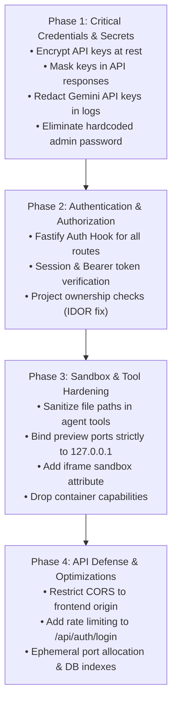

# CodeCraft Comprehensive Security & Architecture Audit Report

**Date:** October 2026  
**Scope:** Full-stack codebase audit (`apps/server`, `apps/web`, `packages/agent`, `packages/ai`, `packages/sandbox`, `packages/db`, `docker`)  
**Status:** Audit Completed — Pending User Review & Approval Before Fixes

---

## Executive Summary

A security and architectural review of the CodeCraft monorepo was conducted following the successful stabilization of AI provider integrations (Gemini 3.5/2.5 multi-turn tools, OpenRouter, and Inngest workflows). 

While the core functionality is active, **multiple high-risk security vulnerabilities and architectural bottlenecks** were identified across authentication, container isolation, secret handling, and web sandboxing. If deployed in a shared or production environment, these weaknesses could allow:
1. **Unauthenticated Remote Code Execution (RCE)** through agent execution and sandbox container escape.
2. **Total Credential & Secret Exposure** via unauthenticated API endpoints returning plaintext provider keys.
3. **Privilege Escalation** via hardcoded superuser auto-creation credentials.
4. **Cross-Origin & Local Network Hijacking** via wildcard CORS and host port binding (`0.0.0.0`).

Below is the complete inventory of security vulnerabilities and optimization opportunities, organized by severity, followed by a prioritized remediation roadmap.

---

## Table of Vulnerabilities & Concerns

| ID | Category | Issue | Severity | CVSS | Affected Files |
|---|---|---|---|---|---|
| **SEC-01** | Auth / Access Control | Unauthenticated API Routes & Broken Object-Level Authorization (IDOR) | **CRITICAL** | 10.0 | `apps/server/src/routes/*.ts` |
| **SEC-02** | Secrets / Auth | Plaintext API Key Exposure via Public Endpoint | **CRITICAL** | 9.8 | `apps/server/src/routes/system.routes.ts`, `packages/db` |
| **SEC-03** | Auth / Credentials | Hardcoded Default Superuser Password (`Password123!`) | **CRITICAL** | 9.8 | `apps/server/src/routes/projects.routes.ts` |
| **SEC-04** | Container Security | Docker Daemon Socket Mount & Potential Host Takeover | **CRITICAL** | 9.8 | `docker-compose.yml`, `container-manager.ts` |
| **SEC-05** | Injection | Unsanitized Shell Interpolation in Agent Tools (`write_file`, `edit_file`) | **HIGH** | 8.8 | `packages/agent/src/tools/*.ts` |
| **SEC-06** | Information Disclosure | Secret Sanitizer Omission for Google Gemini API Keys | **HIGH** | 7.5 | `apps/server/src/utils/secret-sanitizer.ts` |
| **SEC-07** | Network Security | Live Preview Container Port Bound to `0.0.0.0` (All Interfaces) | **HIGH** | 7.5 | `apps/server/src/services/preview-manager.ts` |
| **SEC-08** | Web Security | Missing Iframe Sandbox Attributes in Live Preview Window | **HIGH** | 7.4 | `apps/web/app/projects/[id]/page.tsx` |
| **SEC-09** | File System Security | Workspace Path Traversal via Unresolved Symlinks | **MEDIUM** | 6.5 | `apps/server/src/services/workspace.service.ts` |
| **SEC-10** | API Security | Overly Permissive CORS (`origin: '*'`) & Missing Rate Limiting | **MEDIUM** | 6.5 | `apps/server/src/index.ts`, `agent.routes.ts` |
| **SEC-11** | Container Security | Sandbox Container Runs as Root with Default Capabilities | **MEDIUM** | 6.3 | `docker/sandbox/Dockerfile`, `container-manager.ts` |
| **OPT-01** | Performance | Inefficient Port Scanning in Preview Manager | **LOW** | N/A | `apps/server/src/services/preview-manager.ts` |
| **OPT-02** | Database / Scale | Missing SQLite Indices on Foreign Key Lookups | **LOW** | N/A | `packages/db/src/schema/*.ts` |

---

## Detailed Vulnerability Analysis

### 1. SEC-01: Unauthenticated API Routes & Broken Object-Level Authorization (IDOR)
* **Severity:** CRITICAL (CVSS: 10.0)
* **Locations:**
  * `apps/server/src/routes/projects.routes.ts`
  * `apps/server/src/routes/workspace.routes.ts`
  * `apps/server/src/routes/agent.routes.ts`
  * `apps/server/src/routes/checkpoints.routes.ts`
  * `apps/server/src/routes/system.routes.ts`
* **Vulnerability Description:**
  The Fastify server does not register an authentication guard hook (`onRequest` / `preHandler`) on any project, workspace, agent, or checkpoint routes. An anonymous caller without any session token or Bearer header can:
  - List, create, and delete all user projects (`/api/projects`).
  - Read, overwrite, or delete arbitrary files in any project workspace (`/api/projects/:id/file`).
  - Trigger LLM agent runs and execute arbitrary code in container sandboxes (`/api/projects/:id/agent/run`).
  - View internal git history and roll back commits (`/api/projects/:id/checkpoints`).
* **Exploitation Impact:**
  Complete loss of confidentiality, integrity, and availability. Any anonymous actor on the local or routed network can tamper with files, steal intellectual property, and invoke paid AI LLM credits.
* **Remediation Plan:**
  - Introduce a Fastify authentication plugin (verifying session cookie or `Authorization: Bearer <sessionToken>` against the `sessions` table).
  - Enforce project ownership checks: verify `project.userId === authenticatedUser.id` before allowing workspace operations.
  - Allow public access strictly on `/api/auth/login`, `/api/auth/register`, `/api/health`, and `/api/auth/me`.

---

### 2. SEC-02: Plaintext API Key Exposure via Public Endpoint
* **Severity:** CRITICAL (CVSS: 9.8)
* **Locations:**
  * `apps/server/src/routes/system.routes.ts:35-51`
  * `packages/db/src/repositories/provider.repository.ts:11-48`
  * `packages/db/src/schema/provider-configs.ts:13`
* **Vulnerability Description:**
  - Route `GET /api/system/provider-config` is unauthenticated and returns the full provider configuration object, including `apiKeyEncrypted` directly in plaintext JSON.
  - Route `POST /api/system/provider-config` accepts and overwrites the active provider and API key without authentication.
  - Despite the column being named `api_key_encrypted`, `providerRepository.saveConfig` stores the raw string into SQLite without any cryptographic encryption (AES-256-GCM).
* **Exploitation Impact:**
  An attacker can scrape `/api/system/provider-config` to steal paid OpenAI, Anthropic, OpenRouter, and Google Gemini API keys, leading to financial theft and abuse of the user's AI provider accounts.
* **Remediation Plan:**
  - Implement symmetric encryption at rest using Node.js `crypto` (AES-256-GCM) with an encryption key derived from `ENCRYPTION_KEY` or `JWT_SECRET`.
  - Mask the API key in all API responses (e.g. `AIzaSy...****` or return `{ hasKey: true }`), never returning the plaintext key to the client.
  - Require admin authentication to view or change provider configurations.

---

### 3. SEC-03: Hardcoded Default Superuser Password
* **Severity:** CRITICAL (CVSS: 9.8)
* **Location:** `apps/server/src/routes/projects.routes.ts:28-31`
* **Vulnerability Description:**
  If a project is created without an `x-user-id` header and no superuser exists, the backend automatically seeds a superuser account:
  ```typescript
  const superUser = await userRepository.createSuperUser({
    name: 'Super Admin',
    email: 'admin@codecraft.local',
    password: 'Password123!', // HARDCODED CREDENTIAL
  });
  ```
* **Exploitation Impact:**
  An attacker knowing the open source codebase can send a single POST to `/api/projects`, triggering admin creation, and then log into `/api/auth/login` using `admin@codecraft.local` / `Password123!`.
* **Remediation Plan:**
  - Remove automatic superuser creation with hardcoded passwords.
  - Provide an initial setup / onboarding flow or CLI command (`pnpm run seed:admin`) that prompts the user for a secure password or reads from `ADMIN_DEFAULT_PASSWORD` in `.env`.

---

### 4. SEC-04: Docker Daemon Socket Mount & Potential Host Takeover
* **Severity:** CRITICAL (CVSS: 9.8)
* **Locations:**
  * `docker-compose.yml:13` (`/var/run/docker.sock:/var/run/docker.sock`)
  * `packages/sandbox/src/container-manager.ts`
* **Vulnerability Description:**
  The `codecraft-app` container mounts the host's `/var/run/docker.sock`. Inside Docker, access to the Docker socket is equivalent to having root access on the host machine. If an attacker gains code execution inside `codecraft-app`, they can interact with the Docker daemon to spawn a privileged container mounting the host's root filesystem (`-v /:/host`).
* **Remediation Plan:**
  - Ensure the application container does not run as root.
  - Ensure sandbox containers spawned by `containerManager` are strictly isolated:
    - Never mount the host Docker socket into runner or preview containers.
    - Set `security_opt: ["no-new-privileges:true"]`.
    - Drop dangerous Linux capabilities: `CapDrop: ["ALL"]`.
    - Limit host bind mounts strictly to the isolated project workspace directory (`/data/workspaces/:projectId`).

---

### 5. SEC-05: Unsanitized Shell Interpolation in Agent Tools
* **Severity:** HIGH (CVSS: 8.8)
* **Locations:**
  * `packages/agent/src/tools/write-file.ts:34-48`
  * `packages/agent/src/tools/edit-file.ts:29-55`
* **Vulnerability Description:**
  In `write-file.ts` and `edit-file.ts`, file creation and modification inside the sandbox container execute bash shell strings using template literals:
  ```typescript
  await containerManager.execCommand(
    context.containerId,
    `mkdir -p "${dir}"`,
    { workingDir: '/workspace' }
  );
  await containerManager.execCommand(
    context.containerId,
    `echo "${base64Content}" | base64 -d > "${containerPath}"`,
    { workingDir: '/workspace' }
  );
  ```
  While `base64Content` safely escapes the file content, `dir` and `containerPath` are derived from the tool argument `path`. If an input path contains characters such as `"`, `$()`, or backticks (e.g. `src/"; touch /tmp/pwned; #`), the shell evaluates the injected command.
* **Exploitation Impact:**
  Prompt injection attacks against the LLM could craft malicious filenames that execute arbitrary commands inside the container during write/edit operations.
* **Remediation Plan:**
  - Strictly validate and sanitize relative paths with a regex allowlist (`/^[a-zA-Z0-9_\-\./]+$/`).
  - Reject paths containing shell metacharacters (`` ` ``, `$`, `"`, `'`, `;`, `&`, `|`, `\n`).
  - Use file writes directly on the shared host mount volume or pass arguments safely without shell interpretation.

---

### 6. SEC-06: Secret Sanitizer Omission for Google Gemini API Keys
* **Severity:** HIGH (CVSS: 7.5)
* **Location:** `apps/server/src/utils/secret-sanitizer.ts:5-18`
* **Vulnerability Description:**
  The `SENSITIVE_PATTERNS` regex masks OpenAI keys (`sk-...`), Anthropic (`sk-ant-...`), OpenRouter (`sk-or-v1-...`), and GitHub tokens (`ghp-...`). However, **Google Gemini API keys** (`AIzaSy...`, regex `/AIza[0-9A-Za-z-_]{35}/g`) are omitted.
* **Exploitation Impact:**
  If an error occurs or if debug telemetry is logged/streamed over SSE, raw Google Gemini API keys are exposed unmasked in application logs and browser streams.
* **Remediation Plan:**
  - Add `/AIza[0-9A-Za-z-_]{35}/g` -> `[REDACTED_GEMINI_KEY]` to both `apps/server/src/utils/secret-sanitizer.ts` and `packages/shared/src/secret-sanitizer.ts`.

---

### 7. SEC-07: Live Preview Container Port Bound to `0.0.0.0`
* **Severity:** HIGH (CVSS: 7.5)
* **Location:** `apps/server/src/services/preview-manager.ts:98-100`
* **Vulnerability Description:**
  When spawning Vite preview containers, the port binding is configured as:
  ```typescript
  PortBindings: {
    '3000/tcp': [{ HostPort: port.toString() }],
  }
  ```
  Without specifying `HostIp: '127.0.0.1'`, Docker defaults to binding the port on `0.0.0.0`.
* **Exploitation Impact:**
  The preview web application is exposed to the local network (LAN / Wi-Fi). Any user on the same network can access the in-development application, trigger any endpoints it exposes, or observe private project data.
* **Remediation Plan:**
  - Specify `HostIp: '127.0.0.1'` in `PortBindings`:
    ```typescript
    '3000/tcp': [{ HostIp: '127.0.0.1', HostPort: port.toString() }]
    ```

---

### 8. SEC-08: Missing Iframe Sandbox Attributes in Live Preview Window
* **Severity:** HIGH (CVSS: 7.4)
* **Location:** `apps/web/app/projects/[id]/page.tsx:605-611`
* **Vulnerability Description:**
  The live preview iframe renders without an HTML5 `sandbox` attribute:
  ```tsx
  <iframe
    key={previewKey}
    src={previewUrl}
    title="CodeCraft Preview"
    className="w-full h-full border-none"
  />
  ```
* **Exploitation Impact:**
  Without `sandbox`, the rendered page within the iframe has the ability to navigate the top-level parent window (`window.top.location`), open unconstrained popups, or attempt cross-window attacks against the CodeCraft IDE UI if same-origin conditions are met.
* **Remediation Plan:**
  - Add explicit sandbox constraints:
    ```tsx
    sandbox="allow-scripts allow-forms allow-same-origin allow-modals"
    ```

---

### 9. SEC-09: Workspace Path Traversal via Unresolved Symlinks
* **Severity:** MEDIUM (CVSS: 6.5)
* **Location:** `apps/server/src/services/workspace.service.ts:49-60`
* **Vulnerability Description:**
  `resolveSafePath` checks `resolvedPath.startsWith(projectRoot)` using string comparisons after `path.resolve()`. However, `path.resolve()` does not resolve filesystem symlinks. If a symlink pointing outside the workspace (e.g. `ln -s /etc /workspace/etc`) is introduced, `startsWith` will pass, but subsequent file reads will read host files.
* **Remediation Plan:**
  - Use `fs.realpathSync()` on existing files/directories or check `fs.lstatSync()` to ensure symlinks do not target paths outside the project root.

---

### 10. SEC-10: Overly Permissive CORS & Missing Rate Limiting
* **Severity:** MEDIUM (CVSS: 6.5)
* **Locations:**
  * `apps/server/src/index.ts:25-28` (`origin: '*'`)
  * `apps/server/src/routes/agent.routes.ts:29`
  * `apps/server/src/routes/auth.routes.ts`
* **Vulnerability Description:**
  - CORS is configured with `origin: '*'`. Any external website visited by the user can make cross-origin fetch requests to the local CodeCraft backend.
  - The authentication route `/api/auth/login` has no rate limiting or brute-force throttling.
* **Remediation Plan:**
  - Restrict CORS origins to `http://localhost:3000` (the frontend) and trusted configured origins.
  - Register `@fastify/rate-limit` on `/api/auth/login` (e.g., max 5 attempts per minute per IP).

---

### 11. SEC-11: Insecure Sandbox Container Defaults
* **Severity:** MEDIUM (CVSS: 6.3)
* **Locations:**
  * `docker/sandbox/Dockerfile`
  * `packages/sandbox/src/container-manager.ts`
* **Vulnerability Description:**
  - The sandbox image runs as default user `root`.
  - Containers are spawned without dropping Linux capabilities (`CapDrop: ['ALL']`), leaving standard container capabilities attached.
* **Remediation Plan:**
  - Create and switch to a dedicated non-root user (`node` or `codecraft`, UID 1000) in `Dockerfile`.
  - Configure `CapDrop: ['ALL']` and only grant necessary network/process capabilities.

---

## Code & System Optimizations

### OPT-01: Preview Manager Port Hunting Optimization
* **Location:** `apps/server/src/services/preview-manager.ts:28-50`
* **Observation:** `findFreePort` starts at port 4000 and sequentially creates/destroys TCP listeners one by one to find an open port.
* **Optimization:** Allocate ephemeral ports using OS port binding (`server.listen(0)`), which instantly assigns a free TCP port without sequential trial-and-error overhead.

### OPT-02: SQLite Database Indexing & Query Efficiency
* **Location:** `packages/db/src/schema/*.ts`
* **Observation:** Tables `checkpoints`, `messages`, and `agent_runs` query frequently on `project_id`, but lack explicit indexes on those foreign key columns.
* **Optimization:** Add `.index('idx_checkpoints_project', [checkpoints.projectId])` to eliminate full table scans during chat and history loading.

---

## Proposed Remediation Roadmap

To ensure zero downtime and maintain working AI agent functionality, fixes should be implemented in four sequential phases:



1. **Phase 1: Credentials & Secrets Protection**
   - Implement AES-256-GCM encryption for stored provider keys.
   - Remove plaintext key returns from `/api/system/provider-config`.
   - Update secret sanitizers with Google Gemini key patterns (`AIza...`).
   - Remove hardcoded default superuser password.

2. **Phase 2: Authentication & Access Control**
   - Add auth middleware to protect all `/api/projects/*`, `/api/system/*`, `/api/checkpoints/*`, and `/api/workspace/*` endpoints.
   - Restrict project access so users can only access their own workspaces.

3. **Phase 3: Container & Sandbox Hardening**
   - Sanitize all path parameters in `write_file` and `edit_file` tools to prevent shell injection.
   - Bind preview container ports exclusively to `127.0.0.1`.
   - Add `sandbox` attribute to the Next.js preview iframe.
   - Add `CapDrop: ['ALL']` and `no-new-privileges` to runner containers.

4. **Phase 4: API Defense & Performance Optimization**
   - Lock down CORS to localhost web origin.
   - Add rate limiting to auth endpoints.
   - Add SQLite database indices for project relationships.